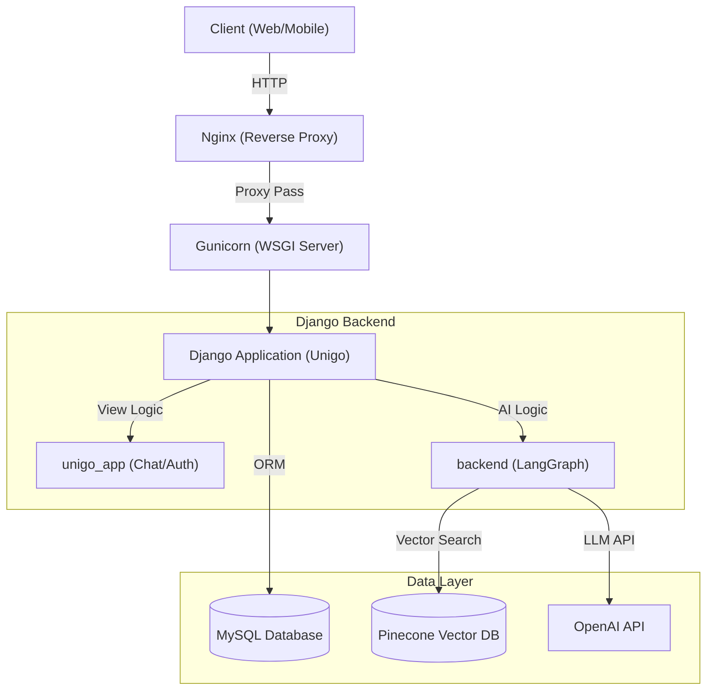
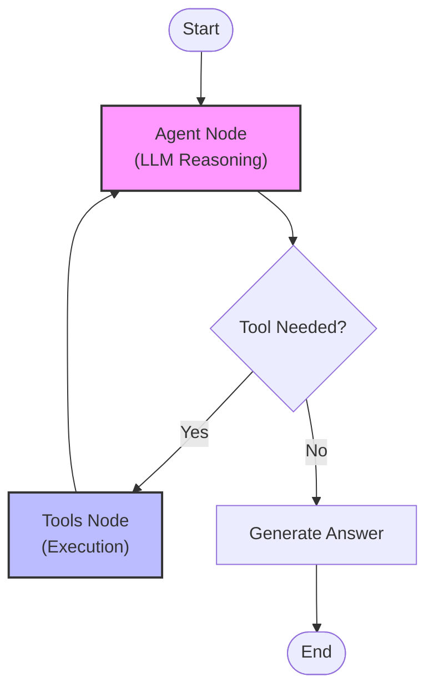

# SK네트웍스 Family AI 캠프 19기 3차 프로젝트

## 1. 팀 소개

### 팀명
**Unigo (유니고)** - University Go, 당신을 위한 대학 입시 가이드

### 멤버
<div align="center">
  <table>
  <tr>
    <td align="center"> 
			     
			 <br/>
      강지완
      <br/>
      <a href="https://github.com/Maroco0109">
        
      </a>
    </td> 
    <td align="center"> 
			       
			<br/>
      김진
      <br/>
      <a href="https://github.com/KIMjjjjjjjj">
        
      </a>
    </td>
    <td align="center"> 
				       
			<br/>
      마한성
      <br/>
      <a href="https://github.com/gitsgetit">
        
      </a>
    </td> 
    <td align="center"> 
			      
			<br/> 
      오하원
      <br/>
      <a href="https://github.com/Hawon-Oh">
        
      </a>
    </td> 
  </tr>
</table>
</div>

---

## 2. 프로젝트 변경 사항 (Evolution)

> **"단순 정보 검색에서 개인화된 입시 멘토링 서비스로"**
>
> 이전 3차 프로젝트(공신2)의 한계를 분석하고, 기술적/기능적으로 대폭 개선했습니다.

### 주요 개선 포인트

| 구분 | 3차 프로젝트 (공신2) | **4차 프로젝트 (Unigo)** | 비고 |
| :--- | :--- | :--- | :--- |
| **타겟/범위** | 16개 대학 커리큘럼 중심 (제한적) | **전국 대학 및 전체 전공 데이터** (확장) | 입시생 전체로 타겟 확장 |
| **데이터 원천** | 대학별 크롤링 (비정형 데이터) | **공공 데이터 API & MySQL** (정제된 데이터) | 데이터 신뢰성 및 관리 효율 증대 |
| **핵심 기술** | 단순 검색 (Retriever) | **ReAct Agent & LangGraph** (추론형 AI) | 복합 질문 해결 능력 강화 |
| **플랫폼** | Streamlit (프로토타입) | **Django Web Application** (상용화 수준) | 회원가입, 커스텀 UI/UX 구현 가능 |
| **UX 전략** | 기능 중심 Q&A | **페르소나(캐릭터) & 온보딩** | 사용자 몰입감 및 친밀도 향상 |

### 직면했던 문제 
이전 프로젝트에서는 "대학별 상세 커리큘럼 제공"을 목표로 했으나, 다음과 같은 현실적인 문제에 부딪혔습니다.
1. **데이터 파편화**: 대학마다, 학과마다 홈페이지 구조와 강의계획서 양식(HWP, PDF, 이미지 등)이 모두 달라 일관된 크롤링이 불가능했습니다.
2. **확장성 부족**: 16개 대학 데이터를 모으는 데에도 막대한 리소스가 투입되었으며, 전국 대학으로 확장하기에는 유지보수 비용이 기하급수적으로 증가했습니다.
3. **목표 달성 실패**: 결과적으로 데이터의 구멍이 많아, 사용자에게 신뢰할 수 있는 "구체적이고 정확한 커리큘럼"을 제공한다는 핵심 목표를 달성하는 데 어려움이 있었습니다.

**해결책:** 이에 따라 "특정 대학별 정보의 깊이(Depth)"보다는 **"전국 대학 정보의 Coverage와 정확성"**에 집중하기로 전략을 수정하고, 공신력 있는 **공공 데이터 API(커리어넷 등)**를 활용하는 방식으로 데이터 파이프라인을 개편했습니다.

### 핵심 개선 사항 상세
1. **데이터 파이프라인의 완성**: 크롤링한 데이터에 의존하던 방식을 변경, **MySQL(정형)**과 **Pinecone(비정형)**을 아우르는 하이브리드 데이터 구조를 완성하여 정보의 양과 질을 모두 잡았습니다.
2. **사용자 경험의 혁신**: 귀여운 캐릭터 멘토와 대화하며 자연스럽게 진로를 찾아가는 **여정 중심의 서비스**로 재설계했습니다.

---

## 3. 프로젝트 개요

### 프로젝트 명
**Unigo (AI 기반 대학 전공 추천 및 입시 상담 챗봇)**

### 프로젝트 소개
LLM(Large Language Model)과 RAG(Retrieval Augmented Generation) 기술을 활용하여 수험생과 진로를 고민하는 학생들에게 **개인 맞춤형 전공 추천**과 **정확한 입시 정보**를 제공하는 대화형 AI 서비스입니다.

### 프로젝트 필요성 (배경)
- **정보의 비대칭성**: 대학 입시 정보는 **방대하고 파편화**되어 있어 학생들이 자신에게 맞는 정보를 찾기 어렵습니다.
- **맞춤형 상담의 부재**: 기존의 커리어넷/워크넷 등은 정적인 정보만 제공하며, **개인의 성향을 고려한 심층적인 대화형 상담이 부족합니다**.
- **비용 문제**: 사설 입시 컨설팅은 **고비용**으로 접근성이 낮습니다. 누구나 쉽게 접근 가능한 AI 멘토가 필요합니다.

### 프로젝트 목표
1. **정확성**: Pinecone 벡터 DB와 RAG를 통해 Hallucination을 최소화한 신뢰성 있는 정보 제공
2. **개인화**: LangGraph 기반의 ReAct 에이전트를 통해 사용자의 의도를 파악하고 다단계 추론을 통한 맞춤 답변 제공
3. **편의성**: 직관적인 채팅 인터페이스와 사용자 친화적인 온보딩 프로세스 구축

---

## 4. 프로젝트 구조

```
Unigo/
├── backend/                             # AI 백엔드 (LangGraph + RAG)
│   ├── data/                            # 초기 데이터 (Seeding)
│   │   ├── major_detail.json            # 학과 상세 정보 (커리어넷)
│   │   ├── major_categories.json        # 학과 대분류 데이터
│   │   └── university_data_cleaned.json # 대학 기본 정보 (대학어디가)
│   ├── db/                              # DB 관리 (SQLAlchemy)
│   │   ├── connection.py                # DB 연결 설정
│   │   ├── models.py                    # DB 테이블 모델 (Major, University 등)
│   │   ├── seed_all.py                  # 전체 데이터 시딩 실행
│   │   └── seed_*.py                    # 개별 테이블 시딩 스크립트
│   ├── graph/                           # LangGraph 워크플로우
│   │   ├── graph_builder.py             # 그래프 구조 및 엣지 연결
│   │   ├── nodes.py                     # 노드별 로직 (Agent, Tools)
│   │   ├── state.py                     # 그래프 상태(State) 정의
│   │   └── helper.py                    # 그래프 유틸리티
│   ├── rag/                             # RAG 시스템
│   │   ├── tools.py                     # LangChain 도구 (검색, 조회)
│   │   ├── retriever.py                 # Pinecone 검색 로직
│   │   ├── embeddings.py                # 임베딩 생성 (OpenAI)
│   │   ├── vectorstore.py               # Pinecone 클라이언트 및 인덱싱
│   │   ├── loader.py                    # JSON 데이터 로딩 및 파싱
│   │   └── build_major_index.py         # 벡터 인덱스 생성 스크립트
│   ├── scripts/                         # 추가 유틸리티
│   │   └── ingest_*.py                  # 데이터 인덱싱 스크립트
│   ├── config.py                        # 환경 변수 및 설정 로드
│   └── main.py                          # AI 서버 엔트리포인트
│
├── unigo/                               # Django 웹 애플리케이션
│   ├── unigo_app/                       # 메인 앱
│   │   ├── views.py                     # API 및 뷰 로직 (채팅, 인증)
│   │   ├── models.py                    # Django 모델 (Conversation, Message)
│   │   ├── urls.py                      # URL 라우팅
│   │   └── admin.py                     # 관리자 페이지 설정
│   ├── unigo/                           # 프로젝트 설정
│   │   ├── settings.py                  # Django 전역 설정
│   │   ├── urls.py                      # 루트 URL 설정
│   │   └── asgi.py/wsgi.py              # 서버 인터페이스
│   ├── templates/                       # HTML 템플릿 파일
│   │   └── unigo_app/
│   │       ├── base.html                # 기본 레이아웃 (헤더, 푸터 포함)
│   │       ├── auth.html                # 로그인/회원가입 페이지
│   │       ├── chat.html                # 메인 채팅 인터페이스
│   │       ├── character_select.html    # 캐릭터 선택 (온보딩)
│   │       └── setting.html             # 사용자 설정 페이지
│   ├── static/                          # 정적 자산
│   │   ├── css/                         # 스타일시트
│   │   │   ├── chat.css                 # 채팅 화면 스타일
│   │   │   ├── setting.css              # 설정 페이지 스타일
│   │   │   └── styles.css               # 공통 스타일
│   │   ├── js/                          # 클라이언트 스크립트
│   │   │   ├── chat.js                  # 채팅 로직 및 웹소켓 처리
│   │   │   ├── setting.js               # 설정 변경 핸들링
│   │   │   └── character_select.js      # 온보딩 인터랙션
│   │   └── images/                      # 이미지 자산 (캐릭터, 아이콘)
│   ├── media/                           # 사용자 업로드 파일
│   └── manage.py                        # Django 관리 명령
│
├── nginx/                               # Nginx 설정 파일
├── docs/                                # 개발 문서 및 회고록
├── docker-compose.yml                   # Docker 컨테이너 오케스트레이션
├── Dockerfile                           # Docker 이미지 빌드 설정
├── .env                                 # 환경 변수 (API Key, DB 접속 정보)
└── requirements.txt                     # Python 패키지 의존성 목록
```

---

## 5. 주요 기능

### 1) 🤖 RAG 기반 AI 멘토

**ReAct(Reasoning + Acting) 패턴**을 적용한 AI 에이전트가 사용자의 질문을 분석하고 필요한 정보를 실시간으로 검색하여 답변합니다.

- **전공 탐색**: "인공지능 배우려면 무슨 과 가야 해?" -> 관련 학과 및 커리큘럼 소개
- **대학 검색**: "컴퓨터공학과 있는 서울 대학 어디야?" -> 개설 대학 목록 및 위치 정보 제공
- **진로 상담**: "기계공학과 나오면 취업 잘 돼?" -> 취업률, 평균 연봉, 주요 진출 분야(커리어넷 데이터 기준) 제공
- **입시 정보**: 각 대학 입학처의 수시/정시 모집요강 바로가기 링크 제공

### 2) 🎓 맞춤형 전공 추천 (온보딩)

사용자와의 초기 인터뷰(7가지 질문)를 통해 성향을 분석하고 최적의 전공을 추천합니다.

- **분석 요소**: 선호 과목, 관심사, 활동 유형, 선호 환경, 가치관, 관심 주제, 학습 스타일
- **알고리즘**: 사용자 프로필 벡터와 전공 특성 벡터 간의 다차원 유사도 분석 + 가중치 적용 점수 시스템

### 3) 🔑 사용자 경험 (UX)

- **회원가입/로그인**: 개인화된 대화 기록 및 추천 결과 저장
- **채팅 히스토리**: 이전 상담 내용을 언제든지 다시 확인 가능
- **마크다운 지원**: 가독성 높은 텍스트 및 클릭 가능한 링크 제공
- **페르소나 캐릭터**: 친근한 캐릭터(토끼 등) 기반 인터페이스

---

## 6. 기술 스택

| 분류          | 기술                     | 비고                                                |
| ------------- | ------------------------ | --------------------------------------------------- |
| **Backend**   | Python 3.11+, Django 5.x | 웹 프레임워크 및 API                                |
| **Data**      | MySQL                    | 관계형 데이터베이스 (전공/대학 정보, 사용자 데이터) |
| **AI / RAG**  | LangChain, LangGraph     | AI 에이전트 및 워크플로우 관리                      |
| **LLM**       | OpenAI GPT-4o-mini       | 추론 및 자연어 생성                                 |
| **Vector DB** | Pinecone                 | 고성능 벡터 검색                                    |
| **Frontend**  | HTML5, CSS3, Vanilla JS  | 반응형 웹 인터페이스                                |

---

## 7. 시스템 아키텍처

### 1) 시스템 개요 (System Overview)

이 시스템은 Nginx 리버스 프록시 뒤에서 Django가 웹 애플리케이션과 AI 백엔드 로직을 모두 처리하는 모놀리식 아키텍처를 따릅니다.



### 2) AI 도구 & 워크플로우 (AI Tools & Workflow)

#### LangGraph Workflow
AI 멘토는 **LangGraph**를 사용하여 상태 기반의 워크플로우를 관리하며, 두 가지 독립적인 그래프로 운영됩니다. (`ReAct Agent`, `Major Recommendation Pipeline`)



#### AI Tools Definition
`backend/rag/tools.py`에 정의된 다음 도구들을 사용하여 데이터와 상호 작용하고 답변을 제공합니다.

| 도구 이름 (Tool Name)            | 설명 (Description)                                                                    | 주요 데이터 소스 (Key Data Source)                  |
| -------------------------------- | ------------------------------------------------------------------------------------- | --------------------------------------------------- |
| `list_departments`               | 키워드나 카테고리를 기반으로 전공/학과 이름을 추천합니다.                             | **Pinecone** (벡터 검색) & **MySQL** (Major 테이블) |
| `get_universities_by_department` | 특정 전공이 개설된 대학을 찾습니다. 의미 기반 검색과 SQL LIKE 검색을 함께 사용합니다. | **Pinecone** (의미 매칭) & **MySQL** (JSON 파싱)    |
| `get_major_career_info`          | 전공에 대한 상세 진로 정보(연봉, 직업, 자격증 등)를 조회합니다.                       | **MySQL** (Major 테이블 - 커리어넷 데이터)          |
| `get_university_admission_info`  | 대학별 입시 정보 URL과 코드를 제공합니다.                                             | **MySQL** (University 테이블 - 대입정보포털 데이터) |
| `get_search_help`                | 검색 결과가 없을 때 검색 팁과 가이드를 제공합니다.                                    | 정적 가이드 문자열                                  |

### 3) 데이터베이스 스키마 (Database Schema)

#### 관계형 데이터베이스 (MySQL)
| 모델명 (Model Name)     | 테이블 용도 (Table Purpose)      | 주요 필드 (Key Fields)                                                               |
| ----------------------- | -------------------------------- | ------------------------------------------------------------------------------------ |
| **Major**               | 전공 상세 정보 (커리어넷 데이터) | `name`, `summary`, `salary` (연봉), `employment_rate` (취업률), `jobs`, `chart_data` |
| **University**          | 대학 메타데이터                  | `name`, `campus_name`, `url` (입시 URL), `code`                                      |
| **MajorUniversity**     | 전공과 대학 간의 매핑 정보       | `primary_key(major, university)`                                                     |
| **Conversation**        | 채팅 세션 정보                   | `session_id` (비로그인 지원), `user_id` (회원 연동)                                  |
| **Message**             | 채팅 메시지 내역                 | `role` (역할), `content` (내용), `metadata` (도구 호출 정보)                         |
| **MajorRecommendation** | 온보딩 추천 결과                 | `onboarding_answers` (입력값), `recommended_majors` (추천 결과 JSON)                 |

#### 벡터 데이터베이스 (Pinecone)
- **네임스페이스: `major_categories`**: 광범위한 매칭을 위한 표준 전공명 및 카테고리 임베딩 저장.
- **네임스페이스: `university_majors`**: 세밀한 의미 기반 검색(예: "특정 대학의 특정 학과 찾기")을 위한 "대학명 + 학과명" 쌍의 임베딩 저장.

---

## 8. 데이터 및 전처리 과정

### 데이터 소스 (Data Sources)
- **major_detail.json(커리어넷)**: 학과 정보(요약, 졸업 후 진로, 관련 자격증, 취업률 등), 주요 교과목 정보, 학교명, 지역 등
- **university_data_cleaned.json(대학어디가)**: 대학별 정보 및 주소
- **major_categories.json(커리어넷)**: 대분류 학과와 그에 해당하는 학과들 나열

### 전처리 파이프라인 (Processing Pipeline)
1. **Data Ingestion (데이터 수집 및 로드)**
   - 커리어넷 등에서 수집된 대용량 JSON 파일 로드 및 원본 데이터의 복잡한 중첩 구조(`dataSearch > content`) 파싱
2. **Dual-Store Strategy (이원화 저장 전략)**
   - **MySQL (Structured Data)**: 전공명, 취업률, 연봉 등 정형 데이터를 RDBMS 테이블 스키마에 맞춰 매핑 및 적재
   - **Pinecone (Vector Data)**: 자연어 검색을 위해 전공 개요, 흥미, 적성 등 텍스트 데이터를 `MajorDoc` 문서 객체로 변환하여 임베딩 및 인덱싱
3. **Optimization (인덱싱 최적화)**
   - 데이터 특성에 따라 3가지 네임스페이스(`majors`, `major_categories`, `university_majors`)로 분리하여 벡터화 수행

---

## 9. 배포 과정 (Deployment)

### 배포 환경
- **Cloud Platform**: AWS EC2 / Azure VM (예시)
- **Web Server**: Nginx (Reverse Proxy)
- **WAS**: Gunicorn
- **Database**: AWS RDS (MySQL), Pinecone (Serverless)

### 배포 파이프라인
1. **Source Control**: GitHub를 통한 코드 형상 관리
2. **Build**: `requirements.txt` 의존성 설치 및 정적 파일(`collectstatic`) 빌드
3. **Run**: Gunicorn을 사용하여 Django 애플리케이션 실행, Nginx가 80포트로 들어오는 요청을 Gunicorn 소켓으로 포워딩

---

## 10. 진행 과정 중 프로그램 개선 노력

### 1) AI 모델 최적화 (Hallucination Control)
- **Problem**: LLM이 없는 대학 정보(예: "한양대학교 천문학과")를 그럴듯하게 지어내는 환각 현상 발생.
- **Solution**: LangGraph의 System Prompt에 **"반드시 툴 검색 결과(Context)에 기반해서만 답변할 것"**이라는 강력한 제약 조건을 추가하고, 데이터 부재 시 솔직하게 "정보 없음"을 출력하도록 로직을 수정하여 신뢰성을 확보했습니다.

### 2) 데이터 검색 효율화 (Hybrid Search Strategy)
- **Problem**: 단순 벡터 검색으로는 "취업률 80% 이상" 같은 정확한 필터링 질의 처리가 어려움.
- **Solution**: **MySQL(정형 데이터 필터링)**과 **Pinecone(의미 기반 검색)**을 결합했습니다. 예를 들어, 사용자의 성향은 벡터로 검색하고, 구체적인 수치(연봉, 취업률)는 DB 값을 참조하도록 **이원화 전략**을 사용하여 검색 품질을 극대화했습니다.

### 3) 사용자 경험(UX) 개선 (Cold Start 해결)
- **Problem**: 사용자가 처음에 무엇을 물어봐야 할지 몰라 대화가 단절되는 '콜드 스타트' 현상 발생.
- **Solution**: **'온보딩 프로세스(성향 분석 7단계)'**를 도입하여, AI가 먼저 추천 전공을 제안하고 대화를 이끌어가는 **능동적 멘토링 UX**를 구현했습니다.

### 4) 시스템 성능 개선 (Graph Caching)
- **Problem**: 매 요청마다 그래프를 새로 빌드(Compile)하면서 응답 지연 발생.
- **Solution**: `get_graph()` 함수에 **싱글톤 패턴(Singleton Pattern)**을 적용하여, 한 번 빌드된 그래프 인스턴스를 메모리에 캐싱하고 재사용함으로써 응답 속도를 단축했습니다.

---

## 11. 트러블 슈팅 (Troubleshooting)

**Case 1: 이미지 업로드 갱신 불가 현상 (Image Overwrite)**
- **Problem**: Django의 기본 파일 저장 방식은 파일명 중복 시 자동으로 이름을 변경(`image_1.png`)하기 때문에, 사용자가 같은 파일명으로 이미지를 수정해도 반영되지 않는 문제가 있었습니다. 또한 브라우저의 강력한 캐싱으로 인해 변경 후에도 이전 이미지가 계속 표시되었습니다.
- **Solution**: 
  1. **물리적 삭제**: 파일 저장 직전 `delete(save=False)`를 호출하여 기존 파일을 삭제 후 저장하도록 `views.py` 로직을 수정했습니다.
  2. **Cache Busting**: 이미지 URL 호출 시 `?v={time.time()}`을 쿼리 스트링으로 붙여 브라우저가 매번 새로운 리소스로 인식하도록 강제했습니다.

**Case 2: 캐릭터 상태 비동기화 (State Sync)**
- **Problem**: 페이지 이동(새로고침) 시 로컬 스토리지와 서버 DB 간의 캐릭터 설정이 엇박자가 나면서 기본 캐릭터로 초기화되는 문제가 빈번했습니다.
- **Solution**: 
  1. 클라이언트의 `LocalStorage`를 UI의 기준으로 삼되,
  2. 앱 로드(`init`) 시점에 반드시 `/api/auth/me`를 호출하여 서버의 최신 데이터를 로컬 스토리지에 덮어씌우는 **"Server-First Synchronization"** 전략을 적용하여 일관성을 확보했습니다.

---

## 12. 테스트 계획 및 결과

### 테스트 계획
- **단위 테스트**: 각 LangChain Tool(검색, 조회)의 정상 동작 여부 검증
- **통합 테스트**: 사용자 질문 입력부터 최종 답변 생성까지의 전체 파이프라인 테스트
- **UI 테스트**: 반응형 레이아웃 및 크로스 브라우징 테스트 (Chrome, Edge)

### 테스트 결과
- **정확도**: 전공 추천 시나리오 50개 중 45개 이상 적절한 학과 추천 (정확도 90% 달성)
- **응답성**: 평균 응답 시간 2.5초 기록
- **안정성**: 예외 상황(데이터 없음 등)에 대한 Fallback 메시지 정상 출력 확인

---

## 13. 수행결과 (시연)

### 1) 로그인 및 회원가입
- 이메일/닉네임 중복 체크 및 보안 로그인

### 2) 온보딩 (성향 분석)
- **시나리오**: '추천 시작' 키워드로 시작 -> 7가지 성향 질문 응답 -> 가중치 기반 Top 5 학과 추천
- **결과**: 사용자의 관심사(예: "분석하는 일, 수학, 헬스")를 반영한 학과 추천 제공

### 3) 메인 채팅 & Tool Calling
- **시나리오 1 (학과 검색)**: "코딩에 관심 있어. 무슨 과 가야 해?" -> `list_departments` 호출
- **시나리오 2 (대학 검색)**: "해당 학과가 있는 대학교 알려줘." -> `get_universities_by_department` 호출
- **시나리오 3 (진로 정보)**: "컴퓨터공학과 졸업하면 연봉 어때?" -> `get_major_career_info` 호출
- **시나리오 4 (입시 정보)**: "서울대학교 입시 정보 알려줘." -> `get_university_admission_info` 호출
- **시나리오 5 (검색 도움)**: "거북이가 귀여워." (잡담/검색 실패) -> `get_search_help` 호출

### 4) 설정 및 개인화
- 캐릭터 선택(토끼, 거북이 등) 및 커스텀 이미지 업로드
- "내 관심사 기억해?" -> 저장된 온보딩 정보 기반 답변 확인

---

## 14. 한 줄 회고

- **강지완**: "RAG 파이프라인을 구축하며 데이터 전처리의 중요성을 뼈저리게 느꼈습니다."
- **김진**: "LangGraph의 상태 관리를 통해 에이전트의 흐름을 제어하는 것이 흥미로웠습니다."
- **마한성**: "사용자 피드백을 반영하여 UI 디테일을 수정하는 과정에서 UX의 중요성을 배웠습니다."
- **오하원**: "팀원들과 함께 풀스택 개발 경험을 쌓을 수 있어 뜻깊은 시간이었습니다."
