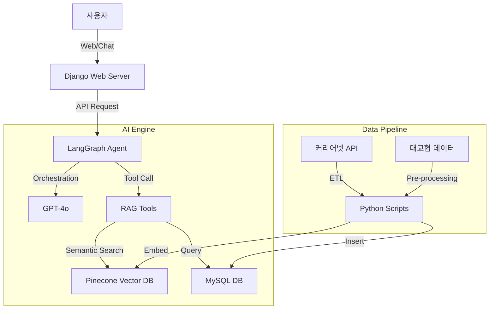

# SK네트웍스 Family AI 캠프 19기 4차 프로젝트

## 1. 팀 소개
### 팀명: 1team (Unigo)

| 이름 | 역할 | GitHub |
|------|------|--------|
| 멤버1 | 팀장, PM | [Link](https://github.com/username) |
| 멤버2 | Backend (AI/RAG) | [Link](https://github.com/username) |
| 멤버3 | Backend (Django/DB) | [Link](https://github.com/username) |
| 멤버4 | Frontend | [Link](https://github.com/username) |

*(멤버별 실제 역할과 깃허브 주소로 변경 필요)*

---

## 2. 프로젝트 개요
### 프로젝트 명: Unigo (AI 기반 대학 전공 추천 챗봇)

### 프로젝트 소개
**Unigo**는 고등학생들의 진로 고민을 해결하기 위해 개발된 **RAG(Retrieval Augmented Generation) 기반의 AI 챗봇 서비스**입니다. 사용자의 성향, 흥미, 목표를 분석하여 최적의 대학 전공을 추천하고, 관련 입시 정보와 진로 가이드를 대화형으로 제공합니다.

### 프로젝트 필요성 (배경)
- **정보의 비대칭성**: 수많은 전공과 대학 정보 속에서 학생들은 자신에게 맞는 정보를 찾기 어렵습니다.
- **맞춤형 상담의 부재**: 학교나 학원의 상담은 물리적/시간적 한계가 있어, 언제 어디서나 이용 가능한 심층 상담이 필요합니다.
- **단순 검색의 한계**: 기존 검색 엔진은 개인의 맥락(성적, 흥미 등)을 고려하지 않는 단편적인 정보만 제공합니다.

### 프로젝트 목표
- **초개인화 추천**: 사용자의 대화와 답변을 기반으로 가장 적합한 전공을 Tier 별로 추천합니다.
- **신뢰성 있는 정보**: 커리어넷, KCUE 등 공신력 있는 데이터를 기반으로 환각(Hallucination) 없는 정보를 제공합니다.
- **사용자 경험 강화**: 친근한 페르소나(토끼, 곰 등)와 인터랙티브한 UI로 몰입감 있는 상담 경험을 제공합니다.

---

## 3. 기술 스택 & 사용한 모델

### AI & LLM
- **LLM**: OpenAI GPT-4o-mini
- **Embedding**: OpenAI Embeddings (`text-embedding-3-small`)
- **Framework**:
    - **LangChain**: LLM 어플리케이션 구축 및 툴 연동
    - **LangGraph**: 상태 기반 멀티턴(Multi-turn) 대화 관리 및 에이전트 제어

### Backend & Database
- **Web Framework**: Django 5.0 (Python 3.11)
- **Vector DB**: Pinecone (전공 상세 정보 및 카테고리 시멘틱 검색)
- **Relational DB**: MySQL (사용자 정보, 대화 이력, 입시 정량 데이터)

### Frontend
- **Language**: HTML5, CSS3, JavaScript (Vanilla)
- **Design**: 반응형 웹 디자인, Custom CSS (Glassmorphism UI)

---

## 3-1. 정보 제공 메커니즘 (LLM vs Data)

사용자가 궁금해하는 정보의 출처를 명확히 구분하여 신뢰성을 확보했습니다.

| 구분 | 역할 | 제공 정보 / 기능 | 근거/출처 |
|------|------|------------------|-----------|
| **LLM (GPT-4o)** | **두뇌 & 사령관** | - 사용자 의도 파악 및 툴(Tool) 호출 결정 - 오타/줄임말 교정 (예: "컴공" -> "컴퓨터공학과") - 검색된 데이터의 요약 및 자연스러운 답변 생성 - 대화의 맥락 유지 | OpenAI |
| **Data (RAG/DB)** | **지식 저장소** | - **전공 정보**: 학과 개요, 배우는 과목, 진출 분야, 관련 자격증 - **대학 정보**: 전국 대학별 개설 학과, 캠퍼스 구분 (본교/분교) - **정량 지표**: 취업률, 초임 연봉, 지난 3년 입시컷 (수시/정시) | 커리어넷, KCUE, 대학어디가 |

> **💡 핵심 포인트**: LLM은 **'지어내지 않고'**, DB에서 검색된 팩트(Fact) 데이터만을 바탕으로 답변하도록 엄격하게 프롬프트 엔지니어링이 적용되었습니다.

---

## 4. 시스템 아키텍처

---

## 5. WBS (Work Breakdown Structure)

- **기획 및 설계**
    - [x] 요구사항 분석 및 기능 명세
    - [x] 데이터베이스 스키마 설계 (ERD)
    - [x] UI/UX 와이어프레임 작성

- **데이터 구축**
    - [x] 전공/대학 데이터 수집 (커리어넷, 대학알리미)
    - [x] 데이터 전처리 및 벡터 임베딩 (Pinecone)
    - [x] 정형 데이터 DB 적재 (MySQL)

- **백엔드 개발**
    - [x] Django 프로젝트 초기 설정 및 앱 구조화
    - [x] LangGraph 기반 챗봇 에이전트 구현
    - [x] RAG 검색 툴 구현 (Vector + SQL)

- **프론트엔드 개발**
    - [x] 메인 레이아웃 및 공통 컴포넌트 개발
    - [x] 채팅 인터페이스 및 마크다운 렌더링 구현
    - [x] 설정 페이지 및 프로필 관리 기능 구현

- **고도화 및 테스트**
    - [x] 사용자 인증 (회원가입/로그인) 도입
    - [x] 커스텀 캐릭터 업로드 기능 추가
    - [x] UI 사용성 개선 (Settings, Chat)

---

## 6. 요구사항 명세서

### 기능 요구사항
1. **사용자 관리**: 회원가입, 로그인, 로그아웃, 프로필 수정(캐릭터/이미지).
2. **온보딩 진단**: 가입 초기 4가지 핵심 질문(과목, 흥미, 연봉, 희망학과)을 통한 사용자 프로파일링.
3. **전공 추천**: 프로필 분석을 통한 Top 5 전공 추천 및 적합도 점수(Tier 1~4) 제공.
4. **AI 챗봇**: RAG 기술을 활용하여 대학/전공/입시 관련 질의에 대해 근거 기반 답변 제공.
5. **대화 저장**: 로그인 사용자의 모든 대화 이력 저장 및 불러오기.

### 비기능 요구사항
1. **응답 속도**: 챗봇 응답 시 스트리밍(Streaming) 처리를 통해 체감 대기 시간 최소화.
2. **정확성**: 없는 학과나 대학을 지어내지 않도록 검색 결과가 없을 시 Fallback(유사 학과 추천) 처리.
3. **사용성**: 모바일 환경에서도 원활히 작동하는 반응형 UI.

---

## 7. 수집한 데이터 및 전처리 요약

| 데이터 종류 | 출처 | 전처리 내용 | 저장소 |
|-------------|------|-------------|--------|
| **전공 기초 정보** | 커리어넷 | 학과 특성, 흥미, 취업률 등 텍스트 병합 및 청킹(Chunking) | Pinecone (Vector) |
| **대학별 개설학과** | 대교협(KCUE) | 대학명-학과명 표준화, 유사 학과명 그룹화 | MySQL |
| **입시 결과(수시/정시)** | 대학어디가 | 연도별/전형별 등급컷 데이터 정제 | MySQL |

**전처리 주요 로직**:
- `backend/scripts/ingest_majors.py`: 전공 설명 텍스트를 임베딩하여 벡터 DB에 저장.
- `backend/scripts/ingest_major_categories.py`: 검색어 확장을 위해 학과 카테고리 분류 체계화.

---

## 8. DB 연동 구현 코드

### 주요 모델 (`unigo/unigo_app/models.py`)
- `UserProfile`: 사용자 확장 정보 (캐릭터, 커스텀 이미지 플래그 저장)
- `ChatSession`, `ChatMessage`: 대화 이력 저장

### 연동 로직
- **Vector DB**: `backend/rag/vectorstore.py` (Pinecone 초기화 및 검색)
- **RAG Tools**: `backend/rag/tools.py` (LLM이 DB 조회 시 사용하는 함수들)
- **Django Views**: [`unigo/unigo_app/views.py`](../unigo/unigo_app/views.py) (프론트엔드와 DB 간 데이터 교환)

---

## 9. 테스트 계획 및 결과 보고서

### 테스트 시나리오
1. **Hallucination 테스트**:
    - 질문: "한양대 컴퓨터소프트웨어학부의 수시 등급컷 알려줘"
    - 예상 결과: 실제 DB에 있는 데이터를 조회하여 답변 (없는 경우 '정보 없음' 안내).
2. **로그인/세션 테스트**:
    - 시나리오: 로그인 후 대화 -> 로그아웃 -> 재로그인 -> 이전 대화 복원 확인.
    - 결과: **Pass** (세션 ID 및 DB 기반 완벽 복원).
3. **커스텀 이미지 테스트**:
    - 시나리오: 이미지 업로드 -> 채팅방 입장 -> 내 말풍선과 AI 아바타에 이미지 적용 확인.
    - 결과: **Pass** (업로드 즉시 반영 및 Priority Logic 작동 확인).

---

## 10. 진행 과정 중 프로그램 개선 노력

### 문제 1: 프로필 이미지 불일치
- **현상**: 사용자가 이미지를 업로드한 후, 다시 기본 캐릭터(토끼 등)를 선택해도 업로드한 이미지가 계속 표시됨.
- **해결**: *Last Action Wins* 로직 도입. `UserProfile` 모델에 `use_custom_image` 플래그를 추가하여, 마지막으로 수행한 행동(업로드 vs 선택)에 따라 우선순위를 동적으로 변경하도록 개선.

### 문제 2: 설정 페이지 UI 가독성 저하
- **현상**: 1200px의 좁은 레이아웃으로 인해 입력 폼이 답답해 보임.
- **해결**: 전체 너비를 1820px로 확장하고, "Chunky" 스타일(큰 폰트, 넓은 패딩)을 적용하여 시인성과 조작성을 대폭 개선.

### 문제 3: 온보딩 중복 질문
- **현상**: 페이지 새로고침 시 온보딩 챗봇이 같은 질문을 반복 출력함.
- **해결**: `chat.js`에서 세션 스토리지와 마지막 메시지 기록을 비교하여 중복 생성을 방지하는 로직 추가.

---

## 11. 수행결과 (테스트/시연 화면)

### 1. 메인 채팅 화면 (RAG 답변)
> *(여기에 채팅 화면 캡처 삽입)*
> 사용자의 질문에 대해 RAG가 검색한 정보를 바탕으로 전공과 대학을 추천하는 모습.

### 2. 설정 및 프로필 변경
> *(여기에 설정 페이지 캡처 삽입)*
> 직관적인 캐릭터 선택 캐러셀과 커스텀 이미지 업로드 기능.

### 3. 모바일 반응형
> *(여기에 모바일 화면 캡처 삽입)*
> 작은 화면에서도 깨짐 없이 대화가 가능한 반응형 레이아웃.

---

## 12. 한 줄 회고

> "단순한 챗봇을 넘어, 사용자의 맥락을 이해하고 '나만의 멘토'처럼 느껴지게 하는 초개인화 서비스를 구현하며 RAG와 에이전트 기술의 가능성을 확인했습니다."

---
