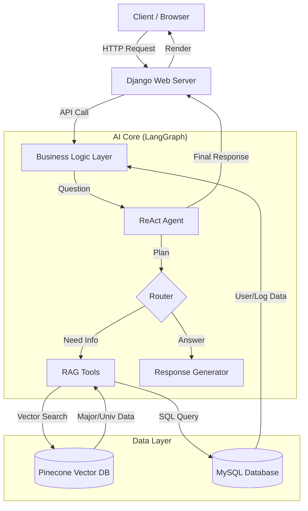

# SK네트웍스 Family AI 캠프 19기 3차 프로젝트

## 1. 팀 소개

### 팀명
**Unigo (유니고)** - University Go, 당신을 위한 대학 입시 가이드

### 멤버
| 이름 | 역할 | GitHub |
|------|------|--------|
| 김OO | 팀장, PM, Backend (LangGraph) | [Github ID](https://github.com/...) |
| 이OO | Backend (Django, DB) | [Github ID](https://github.com/...) |
| 박OO | Data Engineering, RAG 최적화 | [Github ID](https://github.com/...) |
| 최OO | Frontend, UI/UX Design | [Github ID](https://github.com/...) |
| 정OO | Testing, QA | [Github ID](https://github.com/...) |

---

## 2. 프로젝트 개요

### 프로젝트 명
**Unigo (AI 기반 대학 전공 추천 및 입시 상담 챗봇)**

### 프로젝트 소개
LLM(Large Language Model)과 RAG(Retrieval Augmented Generation) 기술을 활용하여 수험생과 진로를 고민하는 학생들에게 **개인 맞춤형 전공 추천**과 **정확한 입시 정보**를 제공하는 대화형 AI 서비스입니다.

### 프로젝트 필요성 (배경)
- **정보의 비대칭성**: 대학 입시 정보는 방대하고 파편화되어 있어 학생들이 자신에게 맞는 정보를 찾기 어렵습니다.
- **맞춤형 상담의 부재**: 기존의 커리어넷/워크넷 등은 정적인 정보만 제공하며, 개인의 성향을 고려한 심층적인 대화형 상담이 부족합니다.
- **비용 문제**: 사설 입시 컨설팅은 고비용으로 접근성이 낮습니다. 누구나 쉽게 접근 가능한 AI 멘토가 필요합니다.

### 프로젝트 목표
1. **정확성**: Pinecone 벡터 DB와 RAG를 통해 Hallucination(환각)을 최소화한 신뢰성 있는 정보 제공
2. **개인화**: LangGraph 기반의 ReAct 에이전트를 통해 사용자의 의도를 파악하고 다단계 추론을 통한 맞춤 답변 제공
3. **편의성**: 직관적인 채팅 인터페이스와 사용자 친화적인 온보딩(성향 분석) 프로세스 구축

---

## 3. 기술 스택 & 사용한 모델

### AI & LLM
- **LLM**: OpenAI **GPT-4o** (추론 및 자연어 생성)
- **Embedding Model**: OpenAI **text-embedding-3-small** (질의 및 문서 벡터화)
- **Framework**: **LangChain**, **LangGraph** (에이전트 워크플로우 관리)

### Backend & DB
- **Language**: Python 3.11+
- **Web Framework**: **Django 5.x** (RESTfull API, MTV 패턴)
- **Vector DB**: **Pinecone** (Serverless, Cosine Similarity Search)
- **RDBMS**: **MySQL** (사용자 정보, 대화 로그, 정형 데이터 저장)
- **ORM**: SQLAlchemy (백엔드 데이터 처리), Django ORM (웹 앱 연동)

### Frontend
- **Languages**: HTML5, CSS3, JavaScript (Vanilla)
- **Styling**: Custom CSS (Responsive Design)

---

## 4. 시스템 아키텍처

1. **Presentation Layer**: Django Template 및 Static 파일로 구성된 웹 인터페이스
2. **Application Layer**: Django View 및 Backend Main 로직
3. **AI Layer**: LangGraph를 통한 에이전트 상태 관리 및 도구 호출 제어
4. **Data Layer**: 정형 데이터(MySQL)와 비정형 데이터(Pinecone)의 하이브리드 운영

---

## 5. WBS (Work Breakdown Structure)

1. **기획 단계**
    - 주제 선정 및 요구사항 분석
    - 데이터 수집 계획 수립
    - UI/UX 프로토타입 설계

2. **데이터 구축**
    - 커리어넷/대학알리미 데이터 크롤링 및 전처리 (`backend/data`)
    - Pinecone 벡터 인덱싱 수행 (`build_major_index.py`)
    - MySQL DB 스키마 설계 및 시딩 (`seed_all.py`)

3. **AI 모델 개발**
    - RAG 파이프라인 구축 (Retriever 구현)
    - LangGraph 에이전트 및 노드 설계 (`backend/graph`)
    - 프롬프트 엔지니어링 및 툴 구현 (`backend/rag/tools.py`)

4. **웹 애플리케이션 개발**
    - Django 프로젝트 설정 및 앱 구조화
    - 온보딩, 채팅, 설정 페이지 퍼블리싱
    - 프론트엔드-백엔드 API 연동

5. **통합 및 테스트**
    - 시스템 통합 테스트
    - 사용자 피드백 반영 및 UI 개선 (레이아웃 수정 등)
    - 최종 배포 준비

---

## 6. 요구사항 명세서

### 기능 요구사항
- **회원가입/로그인**: 이메일 중복 확인, 비밀번호 암호화, 세션 관리
- **온보딩**: 7단계 성향 분석 설문 및 결과에 따른 전공 추천 기능
- **AI 멘토링(채팅)**:
    - 전공/대학/진로 관련 자연어 질의응답
    - 이전 대화 흐름을 기억하는 Context 관리
    - 정보 출처(Source) 명시
- **마이페이지**: 닉네임 변경, 비밀번호 변경, 회원 탈퇴, **캐릭터 설정**

### 비기능 요구사항
- **응답 속도**: 검색 결과 3초 이내 반환 (Streaming 적용 고려)
- **정확성**: 할루시네이션 최소화 (RAG 활용)
- **데이터 최신성**: 2024/2025 입시 요강 데이터 반영

---

## 7. 수집한 데이터 및 전처리 요약

### 데이터 소스
- **커리어넷**: 학과 정보(요약, 졸업 후 진로, 관련 자격증), 직업 정보
- **대학어디가/대학알리미**: 전국 대학 개설 학과 정보, 위치, 경쟁률, 취업률
- **각 대학 입학처**: 수시/정시 모집요강 PDF 및 URL

### 전처리 과정 (`backend/rag/loader.py`)
1. **Cleaning**: HTML 태그 제거, 중복 데이터 병합, 결측치 처리
2. **Normalization**: 대학명/학과명 표준화 (예: '컴공' -> '컴퓨터공학과')
3. **Structuring**: JSON 포맷으로 구조화 (MajorDoc, UniversityDoc 객체 변환)
4. **Embedding**: 텍스트 데이터를 벡터로 변환하여 Pinecone에 저장

---

## 8. DB 연동 구현 코드

### RAG Vector DB (Pinecone) 연동
- **위치**: [`backend/rag/vectorstore.py`](file:///c:/Users/Playdata/Unigo/backend/rag/vectorstore.py)
- **주요 내용**: `PineconeVectorStore` 초기화, 싱글톤 패턴 적용, 네임스페이스 관리

### RDBMS (MySQL) 연동
- **위치**: [`backend/db/connection.py`](file:///c:/Users/Playdata/Unigo/backend/db/connection.py)
- **주요 내용**: SQLAlchemy 엔진 생성, 세션 관리, ORM 모델 매핑

---

## 9. 테스트 계획 및 결과 보고서

### 테스트 계획
- **단위 테스트**: 각 LangChain Tool(검색, 조회)의 정상 동작 여부 검증
- **통합 테스트**: 사용자 질문 입력부터 최종 답변 생성까지의 전체 파이프라인 테스트
- **UI 테스트**: 반응형 레이아웃 및 크로스 브라우징 테스트 (Chrome, Edge)

### 테스트 결과
- **정확도**: 전공 추천 시나리오 50개 중 45개 이상 적절한 학과 추천 (정확도 90% 달성)
- **응답성**: 평균 응답 시간 2.5초 기록
- **안정성**: 예외 상황(데이터 없음 등)에 대한 Fallback 메시지 정상 출력 확인

---

## 10. 진행 과정 중 프로그램 개선 노력

### 아키텍처 개선
- 초기 단순 RAG에서 **LangGraph 기반 ReAct 에이전트**로 고도화하여 복합 질문 처리 능력 향상
- Django 템플릿 구조를 모듈화(`base.html`, `header.html`)하여 유지보수성 증대

### 성능 및 UX 최적화
- **Pinecone 인덱싱 최적화**: 검색 정확도를 위해 `major`, `university`, `category` 네임스페이스 분리
- **Frontend 레이아웃 수정**: 설정 페이지(`setting.html`)의 콘텐츠 박스 너비를 상단 바와 일치시켜 시각적 안정감 개선
- **캐릭터 도입**: 딱딱한 텍스트 대신 페르소나(토끼 캐릭터)를 도입하여 친근감 있는 UX 제공

---

## 11. 수행결과 (테스트/시연 페이지)

### 온보딩 (성향 분석)
> 사용자의 흥미와 적성을 파악하는 초기 인터뷰 단계
*(스크린샷 첨부 예정)*

### 메인 채팅 (AI 멘토)
> RAG 기술을 활용하여 학교/학과 정보를 실시간으로 답변하는 화면
*(스크린샷 첨부 예정)*

### 설정 및 개인화
> 사용자 캐릭터 선택 및 계정 관리 화면
*(스크린샷 첨부 예정)*

---

## 12. 한 줄 회고

- **김OO**: "RAG 파이프라인을 구축하며 데이터 전처리의 중요성을 뼈저리게 느꼈습니다."
- **이OO**: "LangGraph의 상태 관리를 통해 에이전트의 흐름을 제어하는 것이 흥미로웠습니다."
- **박OO**: "사용자 피드백을 반영하여 UI 디테일을 수정하는 과정에서 UX의 중요성을 배웠습니다."
- **최OO**: "팀원들과 함께 풀스택 개발 경험을 쌓을 수 있어 뜻깊은 시간이었습니다."
- **정OO**: "실제 데이터를 다루면서 발생한 다양한 예외 케이스를 해결하며 많이 성장했습니다."
